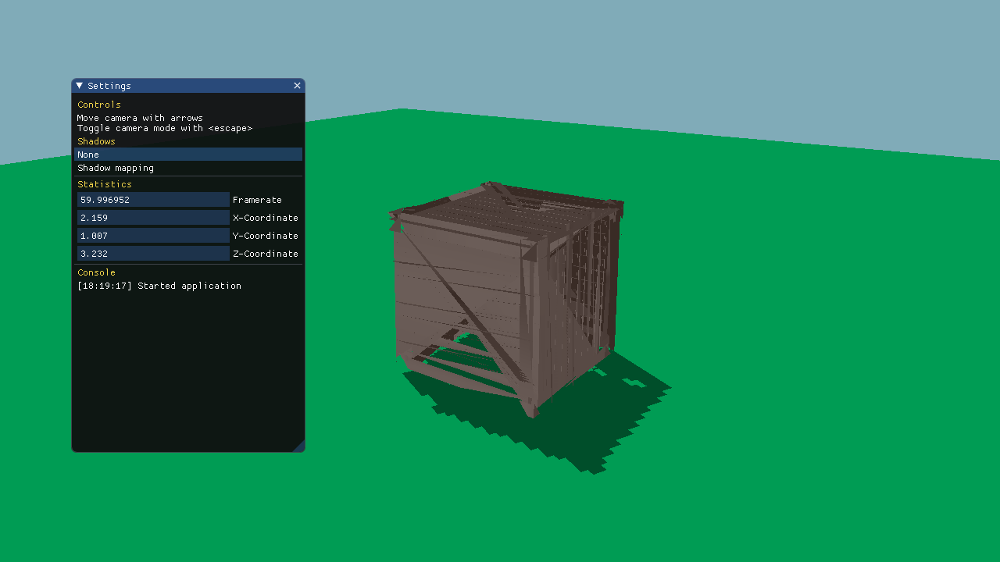

[](https://gitlab.com/abeliam/3d/commits/master)
# Shadow mapping algorithms
Comparison of shadow mapping algorithms

### Usage
#### Compile
This project use [CMake](https://cmake.org) build system. To build the program run the following commands.
```shell
mkdir build
cd build
cmake ..
make -j8
```

#### Screenshot


#### Controls
Toggle between camera and settings mode with `escape`.

Move the camera position with arrows or WASD keys.

Rotate camera angle with mouse.
